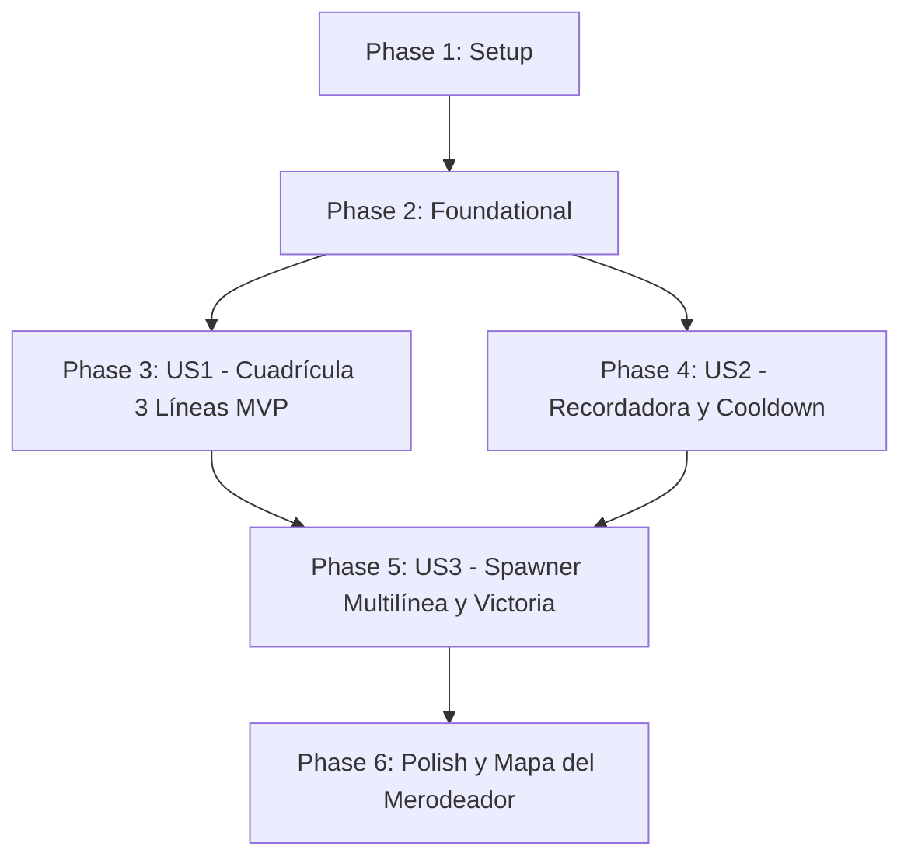

# Tasks: Nivel 2 — Expansión a 3 Líneas y la Recordadora

**Branch**: `002-nivel-2-recordadora` | **Plan**: [plan.md](plan.md) | **Spec**: [spec.md](spec.md)

---

## Phase 1: Setup (Shared Infrastructure)

**Purpose**: Preparar los recursos y la estructura base de archivos para el Nivel 2 y la nueva entidad aliada.

- [x] T001 Crear la escena base y estructura de nodos para `nivel_2.tscn` basada en la arquitectura de `NivelPrincipal.tscn`
- [x] T002 [P] Crear el script base `recordadora.gd` en la raíz con tipado estático estricto y herencia `Area2D` conforme a `AGENTS.md`
- [x] T003 [P] Crear la escena `recordadora.tscn` con nodo raíz `Area2D` y asignación al grupo `aliados`

---

## Phase 2: Foundational (Blocking Prerequisites)

**Purpose**: Generalizar la lógica del nivel en `nivel_principal.gd` para soportar dinámicamente múltiples filas activas, múltiples spawners y cartas adicionales en el HUD sin romper el Nivel 1.

**⚠️ CRITICAL**: Ninguna historia de usuario puede completarse sin estas propiedades y métodos base.

- [x] T004 Generalizar `nivel_principal.gd` exportando `@export var filas_activas: Array[int] = [4]` y `@export var spawners_activos: Array[Marker2D]` para permitir configuración por inspector en cada nivel
- [x] T005 Actualizar el método `_intentar_plantar()` en `nivel_principal.gd` para validar que `celda.y in filas_activas` en lugar de comparar contra la constante fija `FILA_ACTIVA`
- [x] T006 [P] Configurar las capas de colisión en `recordadora.tscn` (`collision_layer = 1`, `collision_mask = 0`) para integrarla en la Capa 1 (Aliados)
- [x] T007 [P] Crear el subnodo `AreaExplosion` (`Area2D`) en `recordadora.tscn` con `RectangleShape2D` de tamaño 384×384 px y `collision_mask = 2` (Enemigos)

**Checkpoint**: Base extensible lista — las historias de usuario pueden implementarse de forma desacoplada.

---

## Phase 3: User Story 1 — Expansión del Campo de Batalla a 3 Líneas (Priority: P1) 🎯 MVP

**Goal**: Configurar la cuadrícula del Nivel 2 para permitir el plantado únicamente en las 3 filas centrales (Filas 3, 4 y 5), manteniendo bloqueadas visual y funcionalmente las filas de los extremos (Filas 2 y 6).

**Independent Test**: Ejecutar `nivel_2.tscn`, comprobar que las Filas 3, 4 y 5 aceptan plantado de Harry y Caja de Snitch, mientras las Filas 2 y 6 muestran el bloqueo visual translúcido y rechazan el clic de plantado sin descontar Snitches.

### Implementation for User Story 1

- [x] T008 [US1] Configurar `filas_activas = [3, 4, 5]` y asignar los spawners correspondientes en el inspector de `nivel_2.tscn`
- [x] T009 [US1] Configurar los nodos de `BloqueoMagico` en `nivel_2.tscn`: mantener visibles `Fila2` (Y=256-384) y `Fila6` (Y=768-896), y ocultar/desactivar `Fila3` y `Fila5`
- [x] T010 [US1] Implementar la instanciación de 5 Dementores en `X=160.0` para las 5 filas (`Y=[320.0, 448.0, 576.0, 704.0, 832.0]`) en `nivel_principal.gd` al iniciar `nivel_2.tscn`
- [x] T011 [US1] Configurar el saldo inicial en 150 Snitches y el `SpawnerDeSnitches` con `wait_time = 10.0` para la economía base en `nivel_2.tscn`

**Checkpoint**: Tablero de 3 líneas funcional y verificado de manera independiente.

---

## Phase 4: User Story 2 — Uso de la Recordadora como Bomba de Área (Priority: P1)

**Goal**: Desarrollar la entidad Recordadora con coste de 150 Snitches, animación de aviso de 1,5 segundos, detonación masiva en radio de 3×3 celdas (1800 de daño a enemigos) y cooldown de recarga de 25 segundos en la carta del HUD.

**Independent Test**: Plantar una Recordadora cerca de Alumnos Slytherin, verificar la animación de 1,5 segundos, la eliminación instantánea de los enemigos en el área de 3×3 celdas sin dañar aliados, la desaparición de la entidad y el bloqueo por cooldown de 25 segundos en el botón del HUD.

### Implementation for User Story 2

- [x] T012 [P] [US2] Implementar propiedades y método `recibir_danio(cantidad: int)` con señal `destruida_sin_explotar` en `recordadora.gd` (salud: 100, coste: 150)
- [x] T013 [US2] Implementar la secuencia de detonación en `recordadora.gd`: temporizador de 1,5 segundos, animación Tween de aviso (pulso de escala `1.0 -> 1.25` y tinte rojizo)
- [x] T014 [US2] Implementar el método `detonar()` en `recordadora.gd`: consultar `AreaExplosion.get_overlapping_areas()`, aplicar 1800 de daño a entidades en grupo `enemigos`, ignorar aliados y llamar a `queue_free()`
- [x] T015 [US2] Agregar el botón `BotonRecordadora` al contenedor de cartas del `HUD` en `nivel_2.tscn` con etiqueta de coste `"Recordadora (150)"`
- [x] T016 [US2] Implementar en `nivel_principal.gd` la lógica de cooldown de 25 segundos para la Recordadora: control de tiempo regresivo en `_process(delta)` y habilitación del botón si `snitches >= 150 and tiempo_recarga_recordadora <= 0.0`
- [x] T017 [US2] Conectar la selección y plantación de la Recordadora en `_intentar_plantar()` dentro de `nivel_principal.gd`, deduciendo 150 Snitches e iniciando el cooldown de 25 segundos

**Checkpoint**: Recordadora completamente funcional con explosión en área y cooldown en HUD.

---

## Phase 5: User Story 3 — Spawner de Enemigos Multilínea y Flujo de Victoria (Priority: P2)

**Goal**: Adaptar la generación de enemigos para instanciar 20 Alumnos Slytherin cada 6 segundos distribuidos aleatoriamente entre los spawners de las 3 filas activas, culminando en victoria y desbloqueo del Nivel 3 al eliminar a todos los atacantes.

**Independent Test**: Jugar una partida del Nivel 2, confirmar que los enemigos aparecen cada 6 segundos en las Filas 3, 4 y 5 indistintamente, y que al eliminar al enemigo número 20 aparece el modal `¡VICTORIA!` con el mensaje de desbloqueo del Nivel 3.

### Implementation for User Story 3

- [x] T018 [US3] Configurar `TimerSpawneoMortifagos` con `wait_time = 6.0` y `total_enemigos = 20` en `nivel_2.tscn`
- [x] T019 [US3] Actualizar el método `_on_timer_spawneo_timeout()` en `nivel_principal.gd` para seleccionar un spawner aleatorio mediante `spawners_activos.pick_random()` antes de instanciar al Alumno Slytherin
- [x] T020 [US3] Conectar la señal `enemigo_derrotado` para contabilizar la cuota de 20 enemigos y disparar `_victoria()` cuando `enemigos_derrotados >= 20` y no queden enemigos en pantalla en `nivel_principal.gd`
- [x] T021 [US3] Configurar el modal de fin de partida en `nivel_2.tscn` para actualizar `MenuNiveles.progreso_desbloqueado = maxi(MenuNiveles.progreso_desbloqueado, 3)` e informar del desbloqueo del Nivel 3

**Checkpoint**: Oleada de 20 enemigos, distribución multilínea y condición de victoria integradas.

---

## Phase 6: Polish & Cross-Cutting Concerns

**Purpose**: Integración de navegación en el Mapa del Merodeador y validación global del nivel.

- [x] T022 Actualizar `menu_niveles.gd` para mapear el botón `Nivel 2` con la carga de `nivel_2.tscn` al ser presionado
- [x] T023 Configurar en `menu_niveles.tscn` la referencia exportada a `nivel_2.tscn` para el slot del Nivel 2
- [x] T024 Ejecutar y verificar los 4 escenarios de prueba de `specs/002-nivel-2-recordadora/quickstart.md` (plantado en 3 filas, bomba 3×3, cooldown y victoria)
- [x] T025 Limpieza de código y verificación de tipado estático estricto en todos los scripts modificados y creados

---

## Dependencies & Execution Order

### Phase Dependencies

### User Story Completion Order

1. **User Story 1 (P1 - MVP)**: Habilita el tablero de 3 líneas donde jugará el usuario.
2. **User Story 2 (P1)**: Proporciona la herramienta táctica (Recordadora) necesaria para defender las 3 líneas.
3. **User Story 3 (P2)**: Configura la presión enemiga (20 atacantes a 6s) y el cierre de ciclo con victoria.

---

## Parallel Execution Opportunities

- **Fase 1**: `T002` (`recordadora.gd`) y `T003` (`recordadora.tscn`) pueden crearse en paralelo con `T001`.
- **Fase 2**: `T006` y `T007` (colisiones de `recordadora.tscn`) pueden desarrollarse en paralelo con `T004` y `T005` (`nivel_principal.gd`).
- **Fase 3 y 4**: Una vez completada la Fase 2, la implementación de la entidad `Recordadora` (`T012`, `T013`, `T014`) puede correr en paralelo con la configuración de las 3 filas en `nivel_2.tscn` (`T008`, `T009`).

---

## Implementation Strategy

### MVP First (User Story 1 Only)
1. Completar Setup (Fase 1) y Foundational (Fase 2).
2. Completar User Story 1 (Fase 3).
3. **VALIDAR MVP**: Ejecutar `nivel_2.tscn` y confirmar que las Filas 3, 4 y 5 aceptan plantado y las Filas 2 y 6 lo rechazan.

### Entrega Incremental
1. Incorporar User Story 2 (Fase 4): probar Recordadora, radio 3×3, daño de 1800 y cooldown de 25s.
2. Incorporar User Story 3 (Fase 5): probar oleada multilínea de 20 enemigos y victoria.
3. Incorporar Polish (Fase 6): probar navegación desde y hacia el Mapa del Merodeador.
