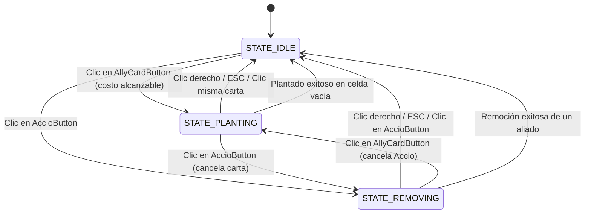

# Data Model: Nivel 4 - Remoción con Hechizo Accio

Este documento define el modelo de datos, estados de interacción y entidades que intervienen en la mecánica de remoción de aliados del Nivel 4.

## 1. Estados de Interacción del Jugador

El gestor de nivel opera bajo una máquina de estados implícita pero estricta para el control de entrada del jugador:



| Estado | Indicador Interno | Representación Visual | Acción Clic Izquierdo en Tablero |
| :--- | :--- | :--- | :--- |
| **`STATE_IDLE`** | `_selected_card == null` y `!_is_removing` | Cursor estándar del sistema. Botones sin toggling. | Ninguna acción sobre celdas. |
| **`STATE_PLANTING`** | `_selected_card != null` | Carta resaltada en verde (`SELECTED_COLOR`). | Intenta instanciar aliado en celda vacía. |
| **`STATE_REMOVING`** | `_is_removing == true` | Cursor del sistema oculto. Cursor placeholder activo. `AccioButton` presionado. | Si hay aliado en celda: remueve y pasa a `STATE_IDLE`. |

---

## 2. Herramienta Accio (Pala)

Entidad de control de interfaz alojada en el HUD.

### Atributos
- **`display_name`**: `"Accio"`
- **`cost`**: `0` snitches
- **`cooldown`**: `0.0` segundos
- **`is_active`**: `bool` (indica si el modo de remoción está encendido)
- **`toggle_color`**: `Color(1.0, 0.4, 0.4)` o estilo presionado para feedback visual en el botón.

### Restricciones y Validaciones
- **FR-002**: No puede bloquearse por falta de snitches ni entrar en temporizador de enfriamiento.
- **FR-015**: No puede estar activa en simultáneo con ninguna `AllyCard`.

---

## 3. Matriz de Ocupación de Cuadrícula

Registro interno conservado en la clase `Level`:

```gdscript
var _occupied_cells: Dictionary = {} # Vector2i -> Ally
```

| Propiedad | Tipo | Descripción |
| :--- | :--- | :--- |
| **Clave** | `Vector2i` | Coordenadas de la celda en la grilla (`TileMapLayer`). |
| **Valor** | `Ally` | Referencia al nodo de la entidad aliada plantada. |

### Transiciones de Ciclo de Vida de Celda
1. **Plantado**:
   - `_occupied_cells[cell] = ally`
   - La celda pasa de libre a ocupada.
2. **Remoción por Accio**:
   - `_occupied_cells.erase(cell)`
   - `ally.queue_free()`
   - La celda vuelve inmediatamente a estado libre.
3. **Muerte natural del Aliado** (enemigo lo destruye):
   - Señal `tree_exiting` conectada a `_on_ally_removed(cell)`.
   - `_occupied_cells.erase(cell)`.

---

## 4. Configuración del Nivel 4

Parámetros exportados del nodo raíz `Level4` (`level_4.tscn`):

| Parámetro | Tipo | Valor | Propósito |
| :--- | :--- | :--- | :--- |
| `starting_snitches` | `int` | `150` | Economía inicial estándar. |
| `active_rows` | `Array[int]` | `[2, 3, 4, 5, 6]` | 5 filas activas (tablero completo). |
| `dementor_row_cells`| `Array[int]` | `[2, 3, 4, 5, 6]` | 5 Dementores defensivos. |
| `enemy_scenes` | `Array[PackedScene]` | `[slytherin_student, draco]` | Variedad de enemigos estándar y blindados. |
| `next_level_to_unlock` | `int` | `5` | Desbloqueo progresivo en el mapa. |
| `card_deck` | HUD Buttons | `Harry`, `SnitchBox`, `Remembrall`, `Protego`, `Accio` | Arsenal completo del nivel. |
