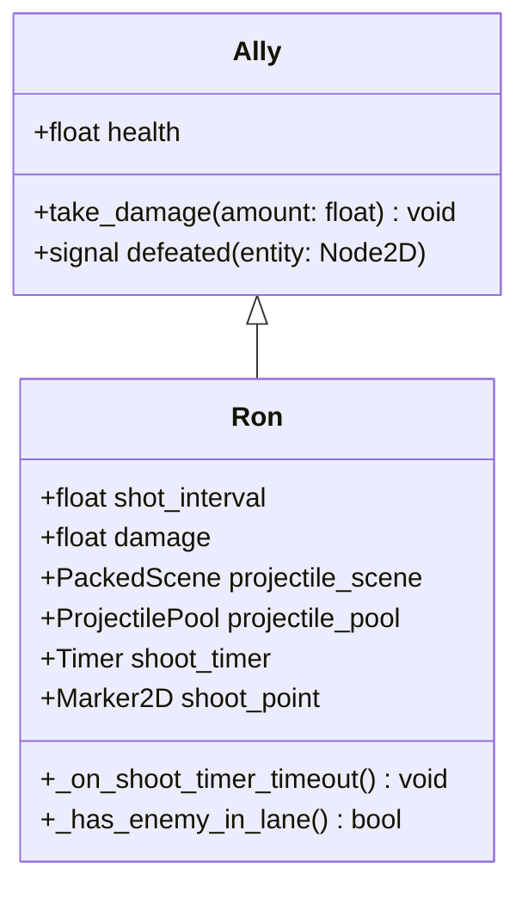
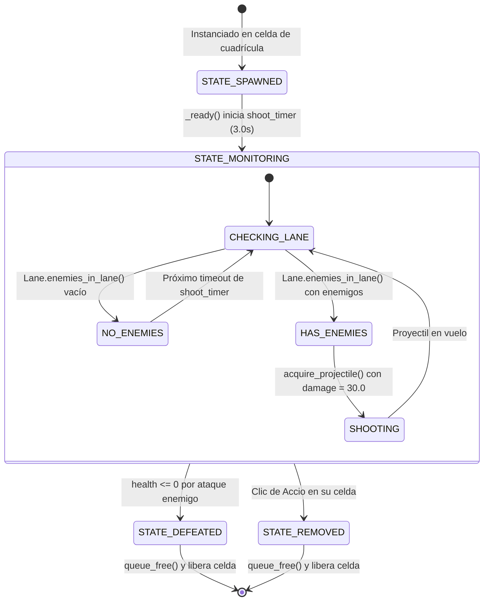

# Data Model: Nivel 5 - Ron y Escalado de Mortífagos

Este documento define el modelo de datos, entidades, atributos y relaciones que componen la funcionalidad del Nivel 5 y la unidad aliada Ron.

## 1. Entidad Aliada: Ron (`Ally`)

Ron es una unidad aliada ofensiva de combate a distancia, especializada en infligir daño concentrado a enemigos de alta resistencia mediante proyectiles pesados a cadencia moderada.

### Atributos de Ron

| Atributo | Tipo | Valor Inicial | Descripción |
| :--- | :--- | :--- | :--- |
| `health` | `float` | `300.0` | Puntos de vida totales antes de ser derrotado. |
| `shot_interval` | `float` | `3.0` | Intervalo en segundos entre cada disparo cuando hay enemigos en la línea. |
| `damage` | `float` | `30.0` | Daño por impacto aplicado al enemigo ($1.5\times$ el daño de Harry). |
| `projectile_scene` | `PackedScene` | `res://projectile.tscn` | Escena base del proyectil. |
| `projectile_pool` | `ProjectilePool` | Inyectado por `Level` | Gestor del pool de proyectiles compartidos. |

### Ciclo de Estados de Ron

---

## 2. Recurso de Carta: `RonCard` (`AllyCard`)

Recurso reutilizable que define las condiciones de compra y enfriamiento en el banco de semillas del HUD.

| Campo | Tipo | Valor | Regla de Negocio |
| :--- | :--- | :--- | :--- |
| `display_name` | `String` | `"Ron"` | Nombre visible en la interfaz (`LABEL_FORMAT_TEXT`). |
| `scene` | `PackedScene` | `res://ron.tscn` | Escena de la entidad instanciada al plantar. |
| `cost` | `int` | `125` | Snitches requeridas para habilitar y plantar la carta. |
| `cooldown` | `float` | `7.5` | Tiempo de recarga en segundos tras plantar. |

---

## 3. Entidad Proyectil (`Projectile`) en Contexto de Ron

El proyectil disparado por Ron utiliza la misma base física y visual que el proyectil estándar, parametrizando su daño:

| Propiedad | Tipo | Valor en Disparo de Ron | Valor en Disparo de Harry |
| :--- | :--- | :--- | :--- |
| `speed` | `float` | `400.0` px/s | `400.0` px/s |
| `damage` | `float` | `30.0` | `20.0` |
| `texture` | `Texture2D` | `res://Images/projectile.png` | `res://Images/projectile.png` |
| `group` | `StringName` | `Groups.SPELLS` | `Groups.SPELLS` |

---

## 4. Configuración del Nivel 5 (`Level`)

| Parámetro | Tipo | Valor | Propósito |
| :--- | :--- | :--- | :--- |
| `active_rows` | `Array[int]` | `[2, 3, 4, 5, 6]` | 5 filas del tablero activas. |
| `dementor_row_cells` | `Array[int]` | `[2, 3, 4, 5, 6]` | 5 Dementores defensivos al inicio de cada carril. |
| `starting_snitches` | `int` | `150` | Economía inicial para arranque defensivo. |
| `total_enemies` | `int` | `25` | Cuota de enemigos regulares antes de oleadas. |
| `enemy_scenes` | `Array[PackedScene]` | `[slytherin_student, draco]` | Mezcla de enemigos con alta tasa de Dracos. |
| `next_level_to_unlock` | `int` | `6` | Desbloqueo del Nivel 6 al vencer. |
| `Grid.position` | `Vector2` | `Vector2(24, -128)` | Posición calibrada sin desfasaje. |
| `Grid.scale` | `Vector2` | `Vector2(1.25, 1.25)` | Escala exacta ($160\text{ px}$ por baldosa). |
