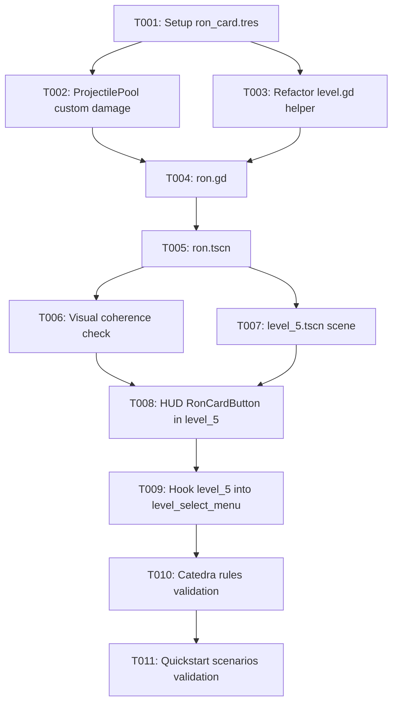

# Tasks: Nivel 5 - Introducción de Ron y Escalado de Mortífagos

**Input**: Design documents from `specs/008-nivel-5-ron/` (`spec.md`, `plan.md`, `research.md`, `data-model.md`, `contracts/node-interfaces.md`, `quickstart.md`).  
**Status**: Ready for execution.

---

## Phase 1: Setup (Shared Infrastructure)

**Purpose**: Assets and base resource definitions needed across the feature.

- [X] T001 [P] Verify `res://Images/ron.png` asset presence and create the ally card resource `ron_card.tres` with `display_name = "Ron"`, `scene = ExtResource("res://ron.tscn")`, `cost = 125`, and `cooldown = 7.5` in `ron_card.tres`

---

## Phase 2: Foundational (Blocking Prerequisites)

**Purpose**: Core infrastructure and architecture adjustments that MUST be complete before user story implementation.

**⚠️ CRITICAL**: Blocks all user stories until completed.

- [X] T002 [P] Extend `projectile_pool.gd` to support optional custom projectile damage by updating `acquire_projectile(spawn_position: Vector2, custom_damage: float = 20.0) -> Projectile` to set `projectile.damage = custom_damage`, and restoring `projectile.damage = 20.0` upon return in `_on_projectile_returned(projectile: Projectile)` in `projectile_pool.gd`
- [X] T003 Refactor `level.gd` by extracting ally dependency injection into a helper method `_init_placed_ally(ally: Ally) -> void` to keep `_place_ally()` under the 15-line limit and inject `projectile_pool` into both `Harry` and `Ron` in `level.gd`

**Checkpoint**: Foundation ready - pool supports custom damage and `level.gd` is structured to inject dependencies into Ron while respecting the 15-line limit.

---

## Phase 3: User Story 1 - Desbloqueo, Plantado y Ataque de Ron (Priority: P1) 🎯 MVP

**Goal**: Permitir la colocación de Ron en la cuadrícula por 125 snitches, atacando con proyectiles de 30.0 de daño (1.5x de Harry) cada 3.0 segundos cuando hay enemigos en su carril.

**Independent Test**: Plantar a Ron en un carril con un Alumno Slytherin (70 HP) y verificar que dispara cada 3.0 s, inflige 30.0 de daño por impacto (derrotando al alumno en exactamente 3 impactos), y cesa el disparo cuando no hay enemigos en el carril.

### Implementation for User Story 1

- [X] T004 [P] [US1] Create the Ron script `ron.gd` extending `Ally` with `@export var shot_interval: float = 3.0`, `@export var damage: float = 30.0`, `@export var projectile_scene: PackedScene`, `@export var projectile_pool: ProjectilePool`, lane detection `_has_enemy_in_lane() -> bool`, and attack execution `_shoot()` in `ron.gd`
- [X] T005 [US1] Create the Ron scene `ron.tscn` as an `Area2D` belonging to group `allies` with `Sprite2D` (`res://Images/ron.png`), `CollisionShape2D`, `ShootPoint` (`Marker2D`), `ShootTimer` (`Timer`), and `DamageFlash` child nodes in `ron.tscn`

**Checkpoint**: User Story 1 completa - Ron puede ser instanciado y ataca a los enemigos en su carril con la cadencia y daño especificados.

---

## Phase 4: User Story 2 - Coherencia Visual y Asignación de Texturas (Priority: P2)

**Goal**: Garantizar que Ron y su carta en el HUD carguen y muestren exclusivamente la textura oficial de `res://Images/ron.png` sin dependencias rotas ni deformaciones.

**Independent Test**: Cargar la escena en Godot e inspeccionar visualmente que tanto la unidad Ron plantada como el botón de carta en el HUD muestran el arte de `res://Images/ron.png`.

### Implementation for User Story 2

- [X] T006 [US2] Verify and enforce visual asset binding in `ron.tscn` ensuring `Sprite2D.texture = ExtResource("res://Images/ron.png")` and verify HUD card display configuration in `ron_card.tres`

**Checkpoint**: User Story 2 completa - Coherencia estética y visual verificada en el tablero y en el banco de cartas.

---

## Phase 5: User Story 3 - Desafío y Progresión del Nivel 5 con Oleadas Densas (Priority: P1)

**Goal**: Configurar la escena del Nivel 5 con 5 líneas activas, 5 Dementores defensivos, cuadrícula calibrada, arsenal completo con Ron y Accio, oleadas densas con alta presencia de Dracos, y desbloqueo del Nivel 6 al ganar.

**Independent Test**: Completar una partida en `level_5.tscn`, resistir las 5 filas y las oleadas densas de Dracos, derrotar la oleada final, y comprobar que se muestra la victoria y se desbloquea el Nivel 6 en el Mapa del Merodeador.

### Implementation for User Story 3

- [X] T007 [P] [US3] Create `level_5.tscn` inheriting root `Level` structure with `active_rows = [2, 3, 4, 5, 6]`, 5 Dementors, calibrated Grid (`position = Vector2(24, -128)`, `scale = Vector2(1.25, 1.25)`), 5 spawn markers, `enemy_scenes = [slytherin_student, draco]`, `EnemySpawnTimer.wait_time = 5.0`, `total_enemies = 25`, and `next_level_to_unlock = 6` in `level_5.tscn`
- [X] T008 [US3] Configure `$HUD` in `level_5.tscn` adding `RonCardButton` with `card = ExtResource("res://ron_card.tres")`, label `"Ron (125)"`, arranged alongside `HarryCardButton`, `SnitchBoxCardButton`, `RemembrallCardButton`, `ProtegoCardButton`, and `AccioButton` in `level_5.tscn`
- [X] T009 [US3] Register `level_5.tscn` in `level_select_menu.tscn` as the 5th element of the `level_scenes` array in `level_select_menu.tscn`

**Checkpoint**: User Story 3 completa - Nivel 5 jugable e integrado con progresión hacia el Nivel 6.

---

## Phase 6: Polish & Cross-Cutting Concerns

**Purpose**: Verificación de reglas de cátedra, aseguramiento de calidad y pruebas de aceptación global.

- [X] T010 [P] Validate code adherence to cátedra rules (strict static typing, English identifiers/comments, Allman braces if applicable, no method exceeding 15 lines) across `ron.gd`, `projectile_pool.gd`, and `level.gd`
- [X] T011 Run manual validation and acceptance scenarios from `specs/008-nivel-5-ron/quickstart.md` (Scenarios 1 to 5) in Godot

---

## Dependencies & Execution Order

### Phase Dependencies

- **Setup (Phase 1)**: Sin dependencias previas. Puede ejecutarse de inmediato.
- **Foundational (Phase 2)**: Depende de Phase 1. Bloquea la implementación de las historias de usuario.
- **User Story 1 (Phase 3)**: Depende de Phase 2 (Foundational). Implementa el atacante Ron.
- **User Story 2 (Phase 4)**: Depende de Phase 3 (`ron.tscn` y `ron_card.tres` creados).
- **User Story 3 (Phase 5)**: Depende de Phase 3 (Ron funcional) y Phase 2 (`level.gd` preparado).
- **Polish (Phase 6)**: Depende de todas las fases anteriores.

---

## Parallel Execution Opportunities

- `T001` (Setup de recurso `ron_card.tres`) y `T002` (Extensión de `projectile_pool.gd`) pueden desarrollarse en paralelo al afectar archivos independientes.
- `T004` (`ron.gd`) y `T007` (`level_5.tscn`) pueden prepararse en paralelo una vez que el pool y el método base estén definidos.
- `T010` (Auditoría estática de reglas de cátedra) puede correr en paralelo a la preparación del entorno de pruebas.

---

## Implementation Strategy

### MVP First (User Story 1 Only)

1. Completar Setup (`T001`) y Foundational (`T002`, `T003`).
2. Completar User Story 1 (`T004`, `T005`).
3. **Validar MVP**: Instanciar y probar a Ron de forma aislada para corroborar cadencia de 3.0 s y daño de 30.0 puntos ($1.5\times$).

### Incremental Delivery

1. **Incremento 1**: Ron funcional con pool de proyectiles parametrizado (US1).
2. **Incremento 2**: Texturas validadas y consistencia visual en HUD (US2).
3. **Incremento 3**: Integración completa del Nivel 5 con oleadas densas y desbloqueo del Nivel 6 (US3).
4. **Incremento 4**: Validación con escenarios de `quickstart.md` y auditoría de límites de 15 líneas por función.
