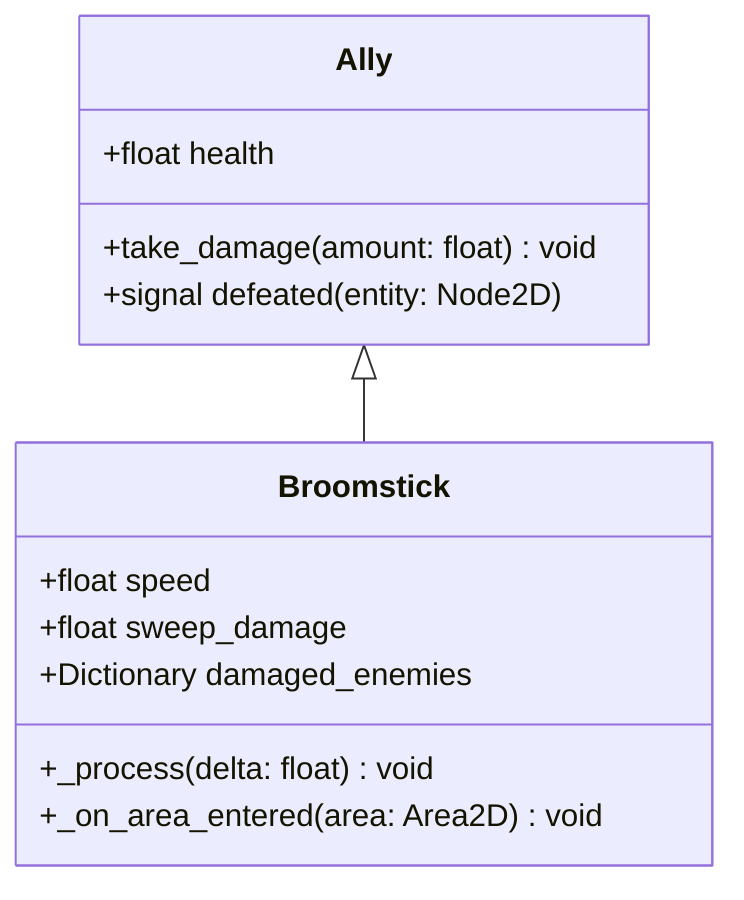
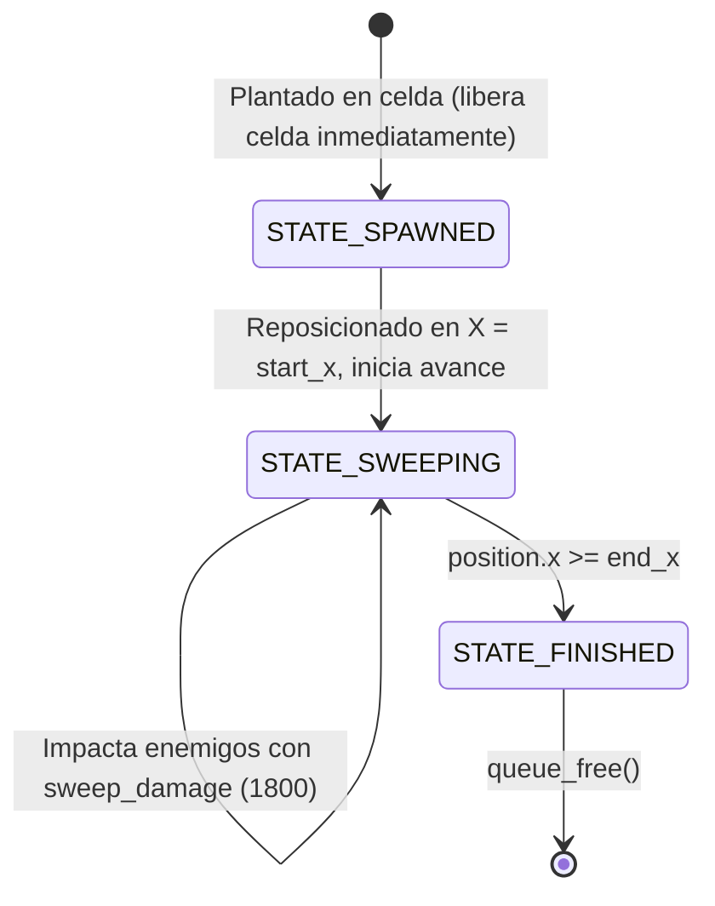
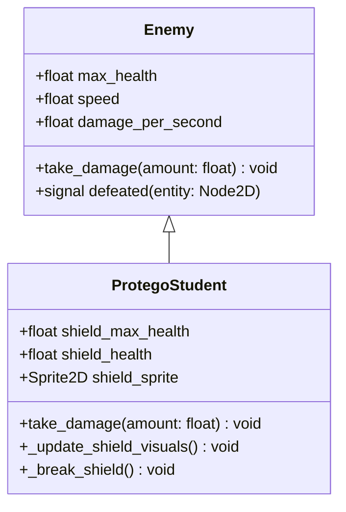
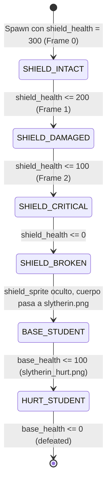

# Data Model: Nivel 6 - Escoba y Alumno con Protego

Este documento define las entidades, atributos, estados y relaciones para las nuevas mecánicas del Nivel 6.

## 1. Entidad: Escoba (`Broomstick`)

Entidad aliada consumible de ataque de área que barre horizontalmente la fila completa aplicando daño masivo.

### Atributos de Broomstick

| Atributo | Tipo | Valor Inicial | Descripción |
| :--- | :--- | :--- | :--- |
| `health` | `float` | `9999.0` | Inmune a ser destruida por enemigos durante su recorrido. |
| `speed` | `float` | `600.0` | Velocidad de desplazamiento horizontal en píxeles por segundo. |
| `sweep_damage` | `float` | `1800.0` | Daño masivo por impacto aplicado a cada enemigo en su carril. |
| `start_x` | `float` | `0.0` | Coordenada X inicial del barrido (extremo izquierdo del carril). |
| `end_x` | `float` | `1950.0` | Coordenada X tras la cual el nodo se libera con `queue_free()`. |

### Ciclo de Vida de Broomstick

---

## 2. Entidad: Alumno con Protego (`ProtegoStudent`)

Enemigo blindado compuesto por un cuerpo de alumno y un escudo frontal con degradación visual y dos modos de combate.

### Atributos de ProtegoStudent

| Atributo | Tipo | Valor Inicial | Descripción |
| :--- | :--- | :--- | :--- |
| `max_health` | `float` | `200.0` | Salud base del alumno tras perder el escudo. |
| `shield_max_health` | `float` | `300.0` | Salud máxima de la barrera Protego. |
| `shield_health` | `float` | `300.0` | Salud actual de la barrera mágica. |
| `speed` | `float` | `32.0` | Velocidad de marcha hacia la izquierda en px/s. |
| `damage_per_second`| `float` | `30.0` | Daño por segundo infligido al aliado que intercepta. |

### Máquina de Estados del Escudo y Animaciones

---

## 3. Recurso de Carta: `BroomstickCard` (`AllyCard`)

| Campo | Tipo | Valor | Regla de Negocio |
| :--- | :--- | :--- | :--- |
| `display_name` | `String` | `"Escoba"` | Nombre visible en el HUD. |
| `scene` | `PackedScene` | `res://broomstick.tscn` | Escena instanciada al plantar. |
| `cost` | `int` | `125` | Snitches requeridas para su compra. |
| `cooldown` | `float` | `25.0` | Recarga "Muy lenta" tras activación. |

---

## 4. Configuración del Nivel 6 (`Level`)

| Parámetro | Tipo | Valor | Propósito |
| :--- | :--- | :--- | :--- |
| `active_rows` | `Array[int]` | `[2, 3, 4, 5, 6]` | 5 filas del tablero activas. |
| `dementor_row_cells` | `Array[int]` | `[2, 3, 4, 5, 6]` | 5 Dementores defensivos. |
| `starting_snitches` | `int` | `150` | Economía inicial. |
| `total_enemies` | `int` | `30` | Cuota de enemigos antes de oleadas finales. |
| `enemy_scenes` | `Array[PackedScene]` | `[slytherin_student, draco, protego_student]` | Mezcla completa de enemigos. |
| `next_level_to_unlock` | `int` | `7` | Desbloqueo del Nivel 7 al triunfar. |
