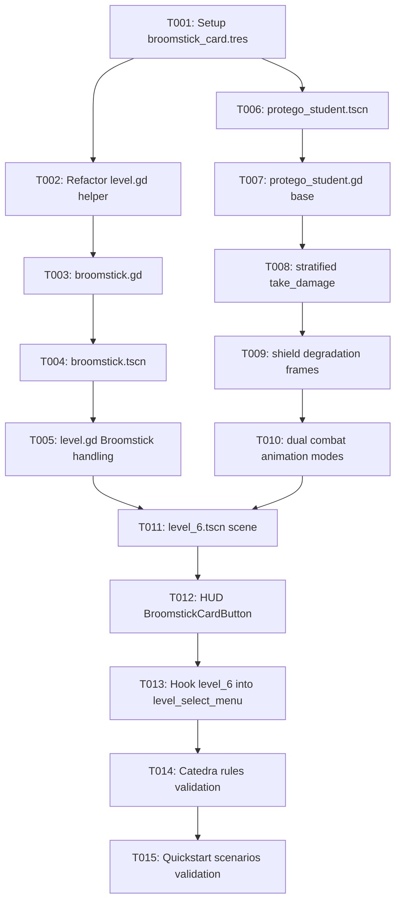

# Tasks: Nivel 6 - Escoba y Alumno con Protego

**Input**: Design documents from `specs/009-nivel-6-escoba-protego/` (`spec.md`, `plan.md`, `research.md`, `data-model.md`, `contracts/node-interfaces.md`, `quickstart.md`).  
**Status**: Ready for execution.

---

## Phase 1: Setup (Shared Infrastructure)

**Purpose**: Assets and base resource definitions needed across the feature.

- [X] T001 [P] Verify `res://Images/broomstick.png` asset presence and create the ally card resource `broomstick_card.tres` with `display_name = "Escoba"`, `scene = ExtResource("res://broomstick.tscn")`, `cost = 125`, and `cooldown = 25.0` in `broomstick_card.tres`

---

## Phase 2: Foundational (Blocking Prerequisites)

**Purpose**: Core infrastructure and grid management adjustments that MUST be complete before user story implementation.

**⚠️ CRITICAL**: Blocks all user stories until completed.

- [X] T002 Extend `level.gd` by adding helper methods `_init_placed_ally(ally: Ally) -> void` and `_handle_broomstick_placed(broom: Broomstick) -> void` to unreserve the occupied grid cell immediately upon planting the broom without exceeding 15 lines per function in `level.gd`

**Checkpoint**: Foundation ready - `level.gd` is prepared to support Broomstick placement with immediate grid freeing.

---

## Phase 3: User Story 1 - Ataque de Área en Fila con la Escoba (Priority: P1) 🎯 MVP

**Goal**: Permitir la colocación de la Escoba por 125 snitches en una fila, desencadenando un barrido horizontal continuo desde el margen izquierdo ($X=0$) hasta el extremo derecho ($X \ge 1950$) a 600 px/s, aplicando 1800.0 puntos de daño masivo a todos los enemigos de la fila.

**Independent Test**: Plantar la Escoba en cualquier celda de una fila con enemigos (Alumno Slytherin, Draco o Protego) y verificar que inicia en $X=0$, avanza a la derecha a 600 px/s, aplica 1800 de daño a cada enemigo sin detenerse y se destruye con `queue_free()` al superar $X=1950$, liberando la celda plantada.

### Implementation for User Story 1

- [X] T003 [P] [US1] Create the Broomstick script `broomstick.gd` extending `Ally` with `@export var speed: float = 600.0`, `@export var sweep_damage: float = 1800.0`, `@export var end_x: float = 1950.0`, `_damaged_enemies: Dictionary[int, bool] = {}`, `_process(delta: float) -> void` for horizontal motion, and `_on_area_entered(area: Area2D) -> void` in `broomstick.gd`
- [X] T004 [US1] Create the Broomstick scene `broomstick.tscn` as an `Area2D` belonging to group `allies` with `Sprite2D` (`res://Images/broomstick.png`), `CollisionShape2D` covering lane height, and `area_entered` signal connection in `broomstick.tscn`
- [X] T005 [US1] Integrate `Broomstick` placement in `level.gd` ensuring `_handle_broomstick_placed()` sets the initial position to lane start ($X = 0$) and unregisters cell occupancy from grid tracking in `level.gd`

**Checkpoint**: User Story 1 completa - La Escoba puede ser plantada y barre la fila completa aplicando daño masivo de 1800 puntos a todos los enemigos.

---

## Phase 4: User Story 2 - Composición Visual del Alumno con Protego (Priority: P2)

**Goal**: Crear la entidad enemiga multiparte con el cuerpo del alumno (`res://Images/slytherin_protego.png`) y el sprite frontal del escudo Protego (`res://Images/protego.png`, `hframes = 3`) posicionado a la izquierda.

**Independent Test**: Instanciar la escena en Godot y verificar visualmente que el Alumno con Protego muestra su cuerpo con túnica y el escudo circular mágico posicionado por delante ($X = -35.0$).

### Implementation for User Story 2

- [X] T006 [P] [US2] Create the scene `protego_student.tscn` as an `Area2D` belonging to group `enemies` with `$Sprite2D` (`res://Images/slytherin_protego.png`, `hframes = 8`), child `$ShieldSprite` (`res://Images/protego.png`, `hframes = 3`, `position = Vector2(-35, -12)`), `CollisionShape2D`, `DetectionArea`, and `AnimationTimer` in `protego_student.tscn`
- [X] T007 [US2] Create base script `protego_student.gd` extending `Enemy` declaring `@export var shield_max_health: float = 300.0`, `var _shield_health: float = 300.0`, `@onready var shield_sprite: Sprite2D = $ShieldSprite`, and initializing visual state in `_ready()` in `protego_student.gd`

**Checkpoint**: User Story 2 completa - La entidad se renderiza correctamente con su composición jerárquica de dos capas visuales.

---

## Phase 5: User Story 3 - Mecánica de Degradación de Escudo y Absorción de Daño (Priority: P1)

**Goal**: Implementar la absorción de daño estratificada (300 HP de escudo primero, 200 HP de salud base después), degradación visual del escudo en 3 estados (Frame 0 >200 HP, Frame 1 100-200 HP, Frame 2 <=100 HP), rotura con desborde y transición de textura a `slytherin.png`.

**Independent Test**: Impactar al Alumno con Protego sucesivamente con proyectiles de Harry (20 de daño) y verificar que transiciona a Frame 1 tras 6 impactos, a Frame 2 tras 11 impactos, desaparece el escudo y cambia la textura a `slytherin.png` al llegar a 15 impactos (300 de daño), y el daño remanente se aplica a la salud base.

### Implementation for User Story 3

- [X] T008 [US3] Implement stratified damage handling in `take_damage(amount: float) -> void` in `protego_student.gd` absorbing damage into `_shield_health`, calculating overflow damage, updating visual thresholds, and delegating overflow to `super.take_damage()` in `protego_student.gd`
- [X] T009 [US3] Implement `_update_shield_visuals() -> void` and `_break_shield() -> void` in `protego_student.gd` to update `shield_sprite.frame` according to remaining health thresholds (Frame 0 >200, Frame 1 100-200, Frame 2 <=100) and upon destruction hide `shield_sprite` and update base sprite texture to `res://Images/slytherin.png` in `protego_student.gd`

**Checkpoint**: User Story 3 completa - Mecánica de escudo con degradación en 3 estados y daño de desborde completamente operativa.

---

## Phase 6: User Story 4 - Animaciones Dinámicas de Ataque con y sin Escudo (Priority: P2)

**Goal**: Dotar al Alumno con Protego de modos de combate duales: oscilación de embestida con escudo mientras lo conserve, y transición inmediata a animación de mordida estándar `slytherin_attacking.png` (y variante `slytherin_attacking_hurt.png`) cuando el escudo sea destruido.

**Independent Test**: Hacer colisionar al Alumno con Protego con un Protego aliado; verificar que oscila el escudo hacia adelante y atrás sin morder, y al destruir el escudo durante la colisión, verificar que pasa de inmediato a la animación de mordida estándar.

### Implementation for User Story 4

- [X] T010 [US4] Implement dynamic combat attack modes in `protego_student.gd`: animate `$ShieldSprite` forward/backward oscillation during ally interaction while shield is active without body bite animation, and switch immediately to `slytherin_attacking.png` upon shield collapse in `protego_student.gd`

**Checkpoint**: User Story 4 completa - Modos de ataque dinámicos con escudo y sin escudo completamente implementados.

---

## Phase 7: User Story 5 - Desafío y Progresión del Nivel 6 (Priority: P1)

**Goal**: Configurar la escena `level_6.tscn` con 5 líneas activas, 5 Dementores defensivos, mazo completo de 6 cartas (incluida la Escoba) y herramienta Accio, oleadas densas con Alumnos Slytherin, Dracos y Alumnos con Protego, y desbloqueo del Nivel 7.

**Independent Test**: Jugar el Nivel 6 completo, usar la Escoba y el resto del arsenal contra las oleadas de enemigos, derrotar la oleada final y verificar que se despliega la pantalla de victoria y se desbloquea el Nivel 7 en el Mapa del Merodeador.

### Implementation for User Story 5

- [X] T011 [P] [US5] Create `level_6.tscn` inheriting root `Level` structure with `active_rows = [2, 3, 4, 5, 6]`, 5 Dementors, calibrated Grid (`position = Vector2(24, -128)`, `scale = Vector2(1.25, 1.25)`), 5 spawn markers, `enemy_scenes = [slytherin_student, draco, protego_student]`, `EnemySpawnTimer.wait_time = 4.5`, `total_enemies = 30`, and `next_level_to_unlock = 7` in `level_6.tscn`
- [X] T012 [US5] Configure `$HUD` in `level_6.tscn` adding `BroomstickCardButton` with `card = ExtResource("res://broomstick_card.tres")`, label `"Escoba (125)"`, arranged alongside Harry, SnitchBox, Ron, Remembrall, Protego, and Accio in `level_6.tscn`
- [X] T013 [US5] Register `level_6.tscn` in `level_select_menu.tscn` as the 6th element of the `level_scenes` array in `level_select_menu.tscn`

**Checkpoint**: User Story 5 completa - Nivel 6 jugable de punta a punta con progresión hacia el Nivel 7.

---

## Phase 8: Polish & Cross-Cutting Concerns

**Purpose**: Verificación de reglas de cátedra, aseguramiento de calidad y pruebas de aceptación global.

- [X] T014 [P] Validate code adherence to cátedra rules (strict static typing, English identifiers/comments, Allman braces if applicable, no method exceeding 15 lines) across `broomstick.gd`, `protego_student.gd`, and `level.gd`
- [X] T015 Run manual validation and acceptance scenarios from `specs/009-nivel-6-escoba-protego/quickstart.md` (Scenarios 1 to 5) in Godot

---

## Dependencies & Execution Order

### Phase Dependencies

- **Setup (Phase 1)**: Sin dependencias previas. Puede ejecutarse de inmediato.
- **Foundational (Phase 2)**: Depende de Phase 1. Bloquea la implementación de las historias de usuario.
- **User Story 1 (Phase 3)**: Depende de Phase 2 (Foundational). Implementa la aliada Escoba.
- **User Story 2 (Phase 4)**: Depende de Phase 1 (assets presentes). Implementa la estructura base de `protego_student.tscn`.
- **User Story 3 (Phase 5)**: Depende de Phase 4 (Alumno con Protego creado). Implementa absorción y degradación de escudo.
- **User Story 4 (Phase 6)**: Depende de Phase 5 (lógica de estado de escudo en `protego_student.gd`).
- **User Story 5 (Phase 7)**: Depende de Phase 3 (Escoba) y Phase 5 (Alumno con Protego). Ensambla el Nivel 6.
- **Polish (Phase 8)**: Depende de todas las fases anteriores.

---

## Parallel Execution Opportunities

- `T001` (`broomstick_card.tres`) y `T006` (`protego_student.tscn`) pueden prepararse en paralelo al afectar archivos independientes sin dependencias cruzadas.
- `T003` (`broomstick.gd`) y `T007` (`protego_student.gd`) pueden codificarse en paralelo.
- `T014` (Auditoría estática de reglas de cátedra $\le 15$ líneas) puede correr en paralelo a la preparación del entorno de pruebas.

---

## Implementation Strategy

### MVP First (User Story 1 Only)

1. Completar Setup (`T001`) y Foundational (`T002`).
2. Completar User Story 1 (`T003`, `T004`, `T005`).
3. **Validar MVP**: Instanciar y plantar la Escoba en un carril para verificar el barrido de 600 px/s, daño masivo de 1800 puntos y liberación de la celda de la cuadrícula.

### Incremental Delivery

1. **Incremento 1**: Escoba completamente funcional con barrido de línea (US1).
2. **Incremento 2**: Estructura visual compuesta del Alumno con Protego (US2).
3. **Incremento 3**: Mecánica de escudo con 3 estados de degradación, daño de desborde y rotura (US3).
4. **Incremento 4**: Modos dinámicos de combate con escudo y sin escudo (US4).
5. **Incremento 5**: Escena del Nivel 6 con 5 filas, mazo de 6 cartas más Accio, spawn balanceado y desbloqueo del Nivel 7 (US5).
6. **Incremento 6**: Validación con escenarios de `quickstart.md` y auditoría de límites de 15 líneas por función.
