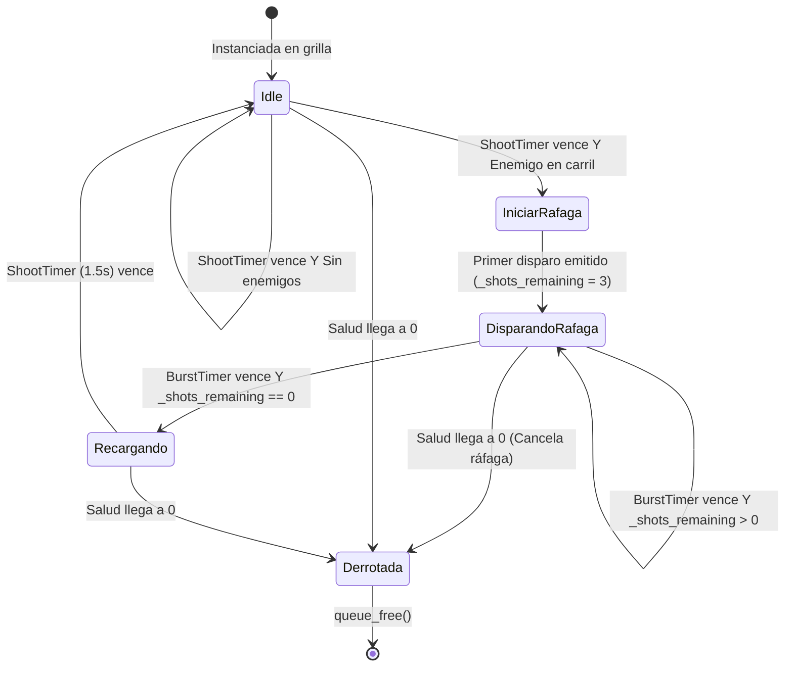
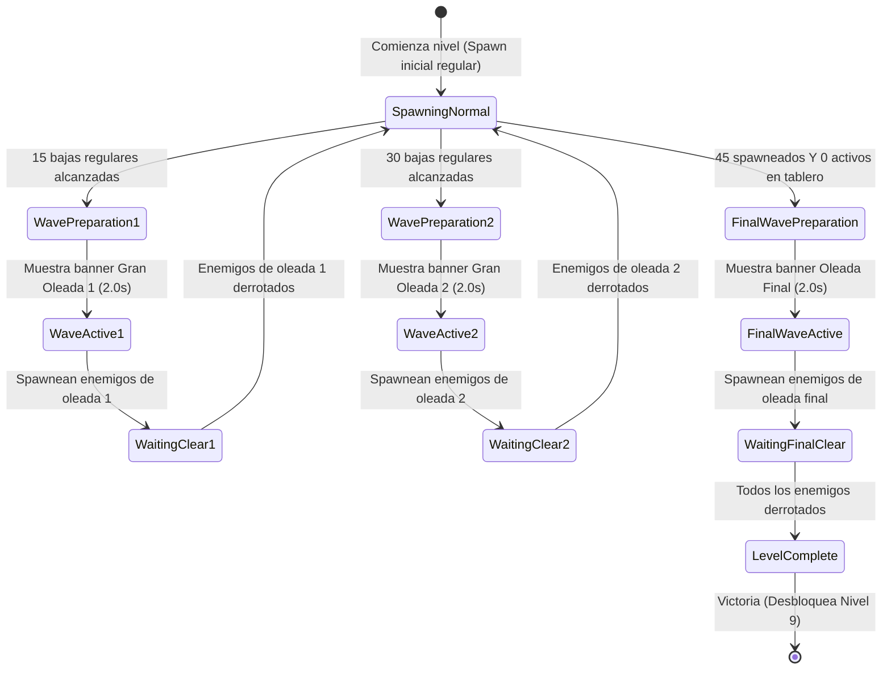

# Data Model & State Specifications: Nivel 8 - McGonagall y Tres Oleadas Masivas

**Feature Branch**: `[011-nivel-8-mcgonagall-tres-oleadas]` | **Date**: 2026-10-07

## 1. Entidad Aliada: McGonagall (`McGonagall`)

### Identificador y Herencia
- **Clase**: `McGonagall`
- **Hereda de**: `Ally` (`res://ally.gd`)
- **Grupo**: `allies`
- **Escena**: `res://mcgonagall.tscn`
- **Script**: `res://mcgonagall.gd`

### Atributos y Propiedades Exportadas
| Propiedad | Tipo | Valor por Defecto | Descripción |
|---|---|---|---|
| `health` | `int` | `300` | Salud base de la aliada (heredada de `Ally`). |
| `shot_interval` | `float` | `1.5` | Tiempo de recarga base (en segundos) tras completar una ráfaga. |
| `burst_interval` | `float` | `0.15` | Intervalo temporal (en segundos) entre disparos consecutivos dentro de la ráfaga. |
| `burst_count` | `int` | `4` | Cantidad total de proyectiles emitidos por ráfaga. |
| `projectile_pool` | `ProjectilePool` | `null` | Referencia al pool de proyectiles compartidos del nivel. |

### Variables de Estado Interno
| Variable | Tipo | Valor Inicial | Descripción |
|---|---|---|---|
| `_shots_remaining` | `int` | `0` | Contador regresivo de disparos pendientes de la ráfaga actual. |
| `shoot_timer` | `Timer` | Nodo hijo (`$ShootTimer`) | Temporizador para el ciclo de recarga base (`one_shot = true`). |
| `burst_timer` | `Timer` | Nodo hijo (`$BurstTimer`) | Temporizador para cadencia interna de ráfaga (`one_shot = false`). |
| `shoot_point` | `Marker2D` | Nodo hijo (`$ShootPoint`) | Posición de origen para el spawn de proyectiles. |

### Diagrama de Estados de McGonagall


---

## 2. Recurso de Carta: McGonagall Card (`mcgonagall_card.tres`)

### Identificador y Tipo
- **Tipo de Recurso**: `AllyCard` (`res://ally_card.gd`)
- **Ruta**: `res://mcgonagall_card.tres`

### Atributos
| Campo | Tipo | Valor | Regla de Validación |
|---|---|---|---|
| `display_name` | `String` | `"McGonagall"` | No vacío; nombre presentado en el botón del HUD. |
| `scene` | `PackedScene` | `ExtResource("mcgonagall.tscn")` | Referencia a la escena instanciable de McGonagall. |
| `cost` | `int` | `200` | Costo en snitches requerido para plantar. |
| `cooldown` | `float` | `7.5` | Tiempo de recarga del botón en el HUD tras plantar. |

---

## 3. Modelo de Estados del Sistema de Oleadas (`level.gd`)

### Constantes de Estado y Textos
```gdscript
const STATE_SPAWNING_NORMAL: int = 0
const STATE_WAVE_PREPARATION: int = 1
const STATE_WAVE_ACTIVE: int = 2
const STATE_WAITING_FOR_CLEAR: int = 3
const STATE_FINAL_WAVE_PREPARATION: int = 4
const STATE_LEVEL_COMPLETE: int = 5

const SPECIAL_FIRST_WAVE_RATIO: float = 0.33
const SPECIAL_SECOND_WAVE_RATIO: float = 0.66
const WAVE_ANNOUNCEMENT_TEXT: String = "¡SE AVECINA UNA GRAN OLEADA DE MORTÍFAGOS!"
const FINAL_WAVE_ANNOUNCEMENT_TEXT: String = "¡OLEADA FINAL!"
const WAVE_ANNOUNCEMENT_DURATION: float = 2.0
```

### Progresión de las 3 Oleadas en Nivel 8 (`total_enemies = 45`)
| Hito de Oleada | Umbral de Bajas Regulares | Texto de Advertencia en Pantalla | Composición y Despliegue |
|---|---|---|---|
| **Gran Oleada 1** | 15 bajas (~33%) | `"¡SE AVECINA UNA GRAN OLEADA DE MORTÍFAGOS!"` | Desembarco simultáneo multilínea (intermedio). |
| **Gran Oleada 2** | 30 bajas (~66%) | `"¡SE AVECINA UNA GRAN OLEADA DE MORTÍFAGOS!"` | Desembarco simultáneo multilínea con incremento de blindados. |
| **Oleada Final** | 45 generados y tablero despejado | `"¡OLEADA FINAL!"` | Desembarco de máxima densidad: Alumnos, Dracos, Protego y Prefectos. |

### Diagrama de Transición de Oleadas en Nivel Especial


---

## 4. Configuración de Escena: Nivel 8 (`level_8.tscn`)

### Propiedades Exportadas del Nodo Raíz (`Level`)
| Propiedad | Tipo | Valor |
|---|---|---|
| `total_enemies` | `int` | `45` |
| `is_special_level` | `bool` | `true` |
| `starting_snitches` | `int` | `150` |
| `next_level_to_unlock` | `int` | `9` |
| `active_rows` | `Array[int]` | `[2, 3, 4, 5, 6]` |
| `dementor_row_cells` | `Array[int]` | `[2, 3, 4, 5, 6]` |
| `enemy_scenes` | `Array[PackedScene]` | `[slytherin_student.tscn, draco.tscn, protego_student.tscn, slytherin_prefect.tscn]` |

### Banco de Cartas en HUD (9 Botones)
1. `HarryCardButton`: Harry (100)
2. `SnitchBoxCardButton`: Caja de Snitch (50)
3. `RonCardButton`: Ron (125)
4. `RemembrallCardButton`: Recordadora (150)
5. `ProtegoCardButton`: Protego (50)
6. `BroomstickCardButton`: Escoba (125)
7. `HermioneCardButton`: Hermione (125)
8. `McGonagallCardButton`: McGonagall (200)
9. `AccioButton`: Accio (0)
