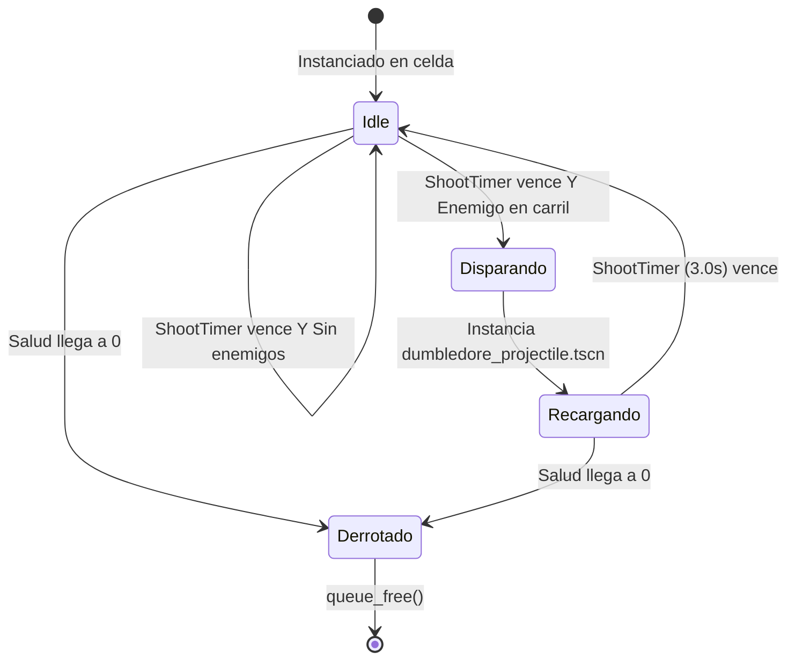
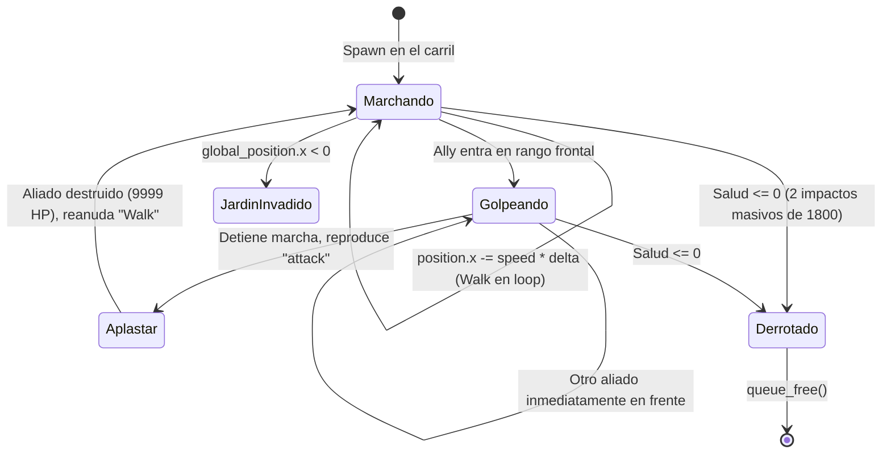

# Data Model & State Specifications: Nivel 9 - Dumbledore y el Troll Colosal

**Feature Branch**: `[012-nivel-9-dumbledore-troll]` | **Date**: 2026-10-08

## 1. Entidad Aliada: Dumbledore (`Dumbledore`)

### Identificador y Herencia
- **Clase**: `Dumbledore`
- **Hereda de**: `Ally` (`res://ally.gd`)
- **Grupo**: `allies`
- **Escena**: `res://dumbledore.tscn`
- **Script**: `res://dumbledore.gd`

### Atributos y Propiedades Exportadas
| Propiedad | Tipo | Valor por Defecto | Descripción |
|---|---|---|---|
| `health` | `int` | `300` | Salud base del aliado (heredada de `Ally`). |
| `shot_interval` | `float` | `3.0` | Tiempo de recarga entre disparos pesados en segundos. |
| `projectile_scene` | `PackedScene` | `res://dumbledore_projectile.tscn` | Escena del proyectil con daño en área. |

### Variables de Estado Interno
| Variable | Tipo | Valor Inicial | Descripción |
|---|---|---|---|
| `shoot_timer` | `Timer` | Nodo hijo (`$ShootTimer`) | Temporizador para el ciclo de recarga base. |
| `shoot_point` | `Marker2D` | Nodo hijo (`$ShootPoint`) | Posición de origen para el lanzamiento de hechizos. |

### Diagrama de Estados de Dumbledore

---

## 2. Entidad Proyectil: Proyectil de Dumbledore (`DumbledoreProjectile`)

### Identificador y Herencia
- **Clase**: `DumbledoreProjectile`
- **Hereda de**: `Area2D`
- **Grupo**: `spells`
- **Escena**: `res://dumbledore_projectile.tscn`
- **Script**: `res://dumbledore_projectile.gd`

### Atributos y Constantes
| Campo | Tipo | Valor | Descripción |
|---|---|---|---|
| `speed` | `float` | `350.0` | Velocidad horizontal de avance (px/s) en línea recta. |
| `splash_damage` | `float` | `20.0` | Daño aplicado a cada enemigo en la caja de 3x3 celdas (igual a disparo de Harry). |
| `SPLASH_BOX_SIZE` | `Vector2` | `Vector2(384.0, 384.0)` | Dimensiones del área de efecto (3 filas x 3 columnas). |
| `END_X` | `float` | `1950.0` | Límite derecho de la pantalla antes de auto-destrucción. |

### Ciclo de Vida y Detección
1. **Avance**: `position.x += speed * delta` en `_process(delta)`.
2. **Impacto**: `_on_area_entered(area)` detecta una entidad del grupo `enemies`.
3. **Detonación de Splash**:
   - Activa `SplashArea` (`RectangleShape2D` de 384x384 px) o evalúa los enemigos en rango.
   - Itera todos los enemigos superpuestos y aplica `enemy.take_damage(splash_damage)`.
   - Emite efecto visual de impacto.
   - Llama a `queue_free()`.

---

## 3. Recurso de Carta: Dumbledore Card (`dumbledore_card.tres`)

### Identificador y Tipo
- **Tipo de Recurso**: `AllyCard` (`res://ally_card.gd`)
- **Ruta**: `res://dumbledore_card.tres`

### Atributos
| Campo | Tipo | Valor | Regla de Validación |
|---|---|---|---|
| `display_name` | `String` | `"Dumbledore"` | Nombre presentado en el HUD. |
| `scene` | `PackedScene` | `res://dumbledore.tscn` | Escena instanciada al plantar. |
| `cost` | `int` | `300` | Costo en snitches. |
| `cooldown` | `float` | `15.0` | Tiempo de recarga en segundos en el HUD. |
| `texture` | `Texture2D` | `res://Images/dumbledore.png` | Icono gráfico de la carta. |

---

## 4. Entidad Enemiga: Troll Colosal (`Troll`)

### Identificador y Herencia
- **Clase**: `Troll`
- **Hereda de**: `Enemy` (`res://enemy.gd`)
- **Grupo**: `enemies`
- **Escena**: `res://troll.tscn`
- **Script**: `res://troll.gd`

### Atributos y Propiedades Exportadas
| Propiedad | Tipo | Valor por Defecto | Descripción |
|---|---|---|---|
| `max_health` | `float` | `3600.0` | Salud máxima calibrada para resistir exactamente 2 ataques masivos (1800 x 2). |
| `speed` | `float` | `20.0` | Velocidad horizontal de traslación hacia la izquierda (px/s). |
| `damage_instakill` | `float` | `9999.0` | Daño destructivo instantáneo aplicado a cualquier planta que colisione. |

### Variables de Estado Interno
| Variable | Tipo | Valor Inicial | Descripción |
|---|---|---|---|
| `_health` | `float` | `3600.0` | Salud actual del Troll. |
| `_is_attacking` | `bool` | `false` | Indica si está ejecutando la animación de golpe a una planta. |
| `_target_ally` | `Ally` | `null` | Referencia al aliado que está siendo aplastado. |
| `animation_player` | `AnimationPlayer` | `$Animation` | Controlador de animaciones ("Walk" y "attack"). |

### Diagrama de Estados del Troll

---

## 5. Escenario del Nivel 9 (`level_9.tscn`)

### Propiedades del Nivel
| Propiedad | Tipo | Valor | Descripción |
|---|---|---|---|
| `active_rows` | `Array[int]` | `[2, 3, 4, 5, 6]` | 5 filas jugables activas. |
| `total_enemies` | `int` | `45` | Presupuesto total de enemigos regulares. |
| `next_level_to_unlock` | `int` | `10` | Nivel desbloqueado tras la victoria (Profesor Quirrell). |
| `dementor_row_cells` | `Array[int]` | `[2, 3, 4, 5, 6]` | 5 Dementores defensivos. |
| `enemy_scenes` | `Array[PackedScene]` | `[SlytherinStudent, Draco, ProtegoStudent, SlytherinPrefect, Troll]` | Lista completa de las 5 amenazas. |

### Banco de 10 Cartas en el HUD
1. Harry (100)
2. Snitch Box (50)
3. Ron (125)
4. Recordadora (150)
5. Protego (50)
6. Escoba (125)
7. Hermione (125)
8. McGonagall (200)
9. Dumbledore (300)
10. Accio (0)
